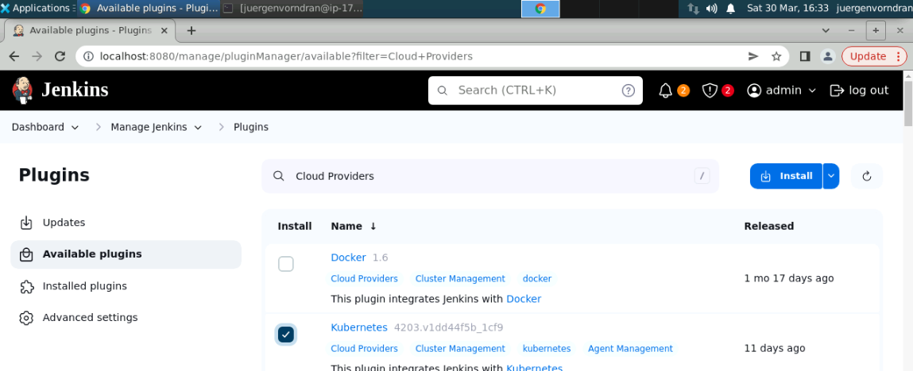
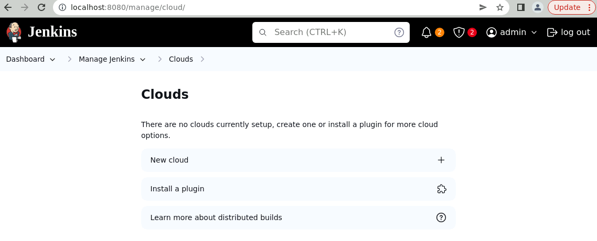
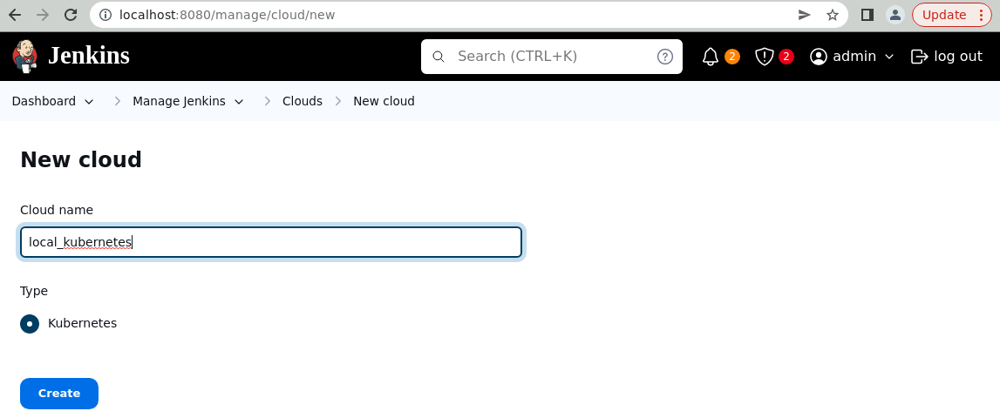
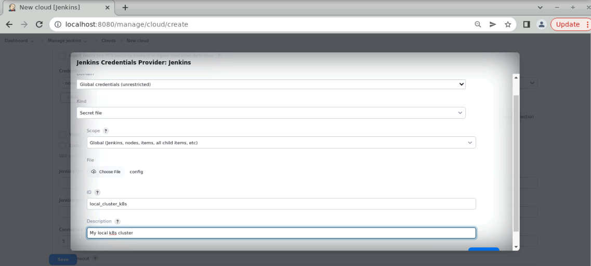
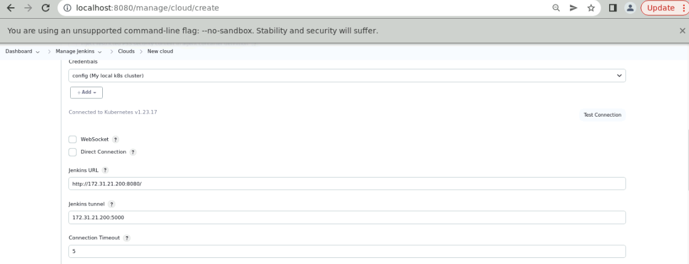
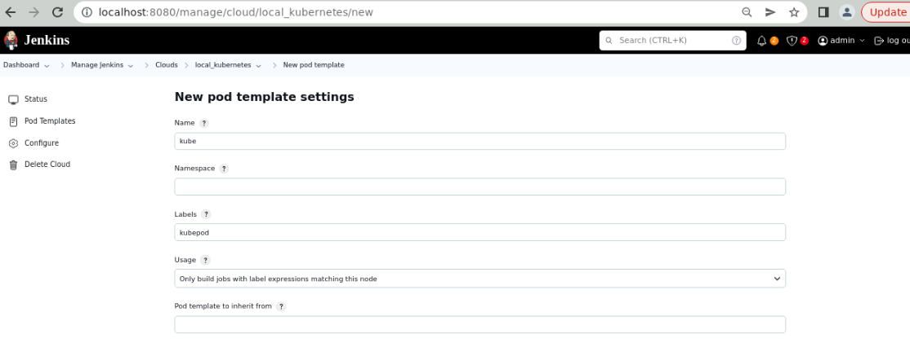
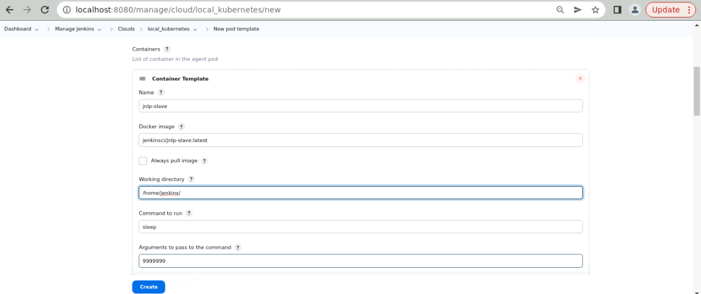
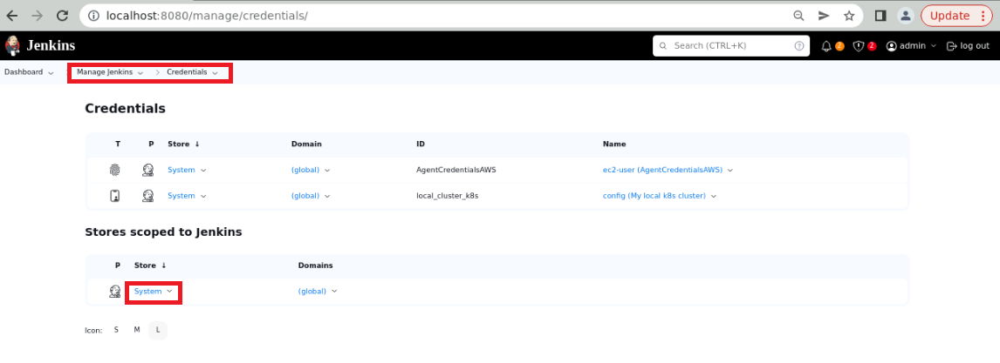
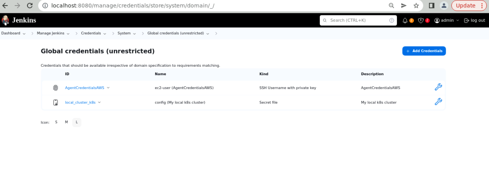

# playjenkins
Jenkins Playground


###Deploy Wordpress Application on Kubernetes
====================

This description shows how Jenkins can be used to deploy and roll out Wordpress on Kubernetes.


1. install the kubernetes plugin in jenkins


2. create new connection to a cloud in jenkins


2.1 new cloud name - local_kubernetes


2.2 config credentials - we use the kube.config file es secrets


2.3 check connection to kubernetes


2.4 add the jenkins URL and tunnel


2.5 save the configuration fron kubernetes

3 config the pod template
3.1 set the name and label for pod template


3.2 create container template with jenkinsci/jnlp-slave


4 create credentials for pipeline
4.1 new credentials


4.2 global credentials add credentials


the kubeconfigId should the same as the jenkins pipeline file

"mykubeconfig"
rndran0A@2aafk
the kubeconfig are enter directly. this means you have to use the config from your home. open the terminal and go to the local ~/.kube/config and open it with less config and copy the whole file and add this to jenkins


Configuration in Jenkins for the connection to Kubernetes
-------------------
```
$ mvn jetty:run
```

Open [http://localhost:8080/](http://localhost:8080/)


Configuration in Jenkins for the connection to Kubernetes
-------------------
```
$ mvn jetty:run
```

Open [http://localhost:8080/](http://localhost:8080/)